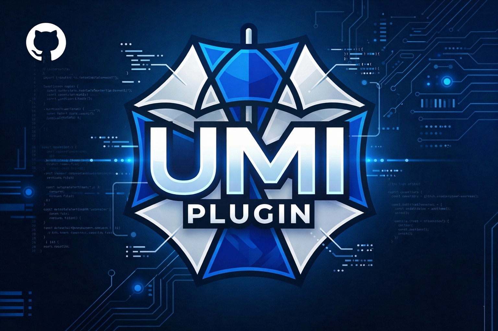
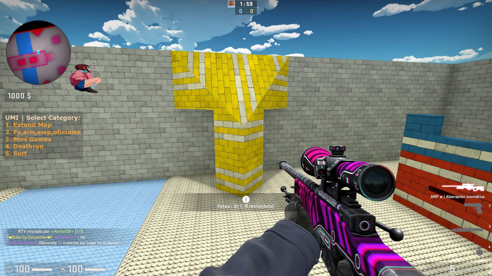
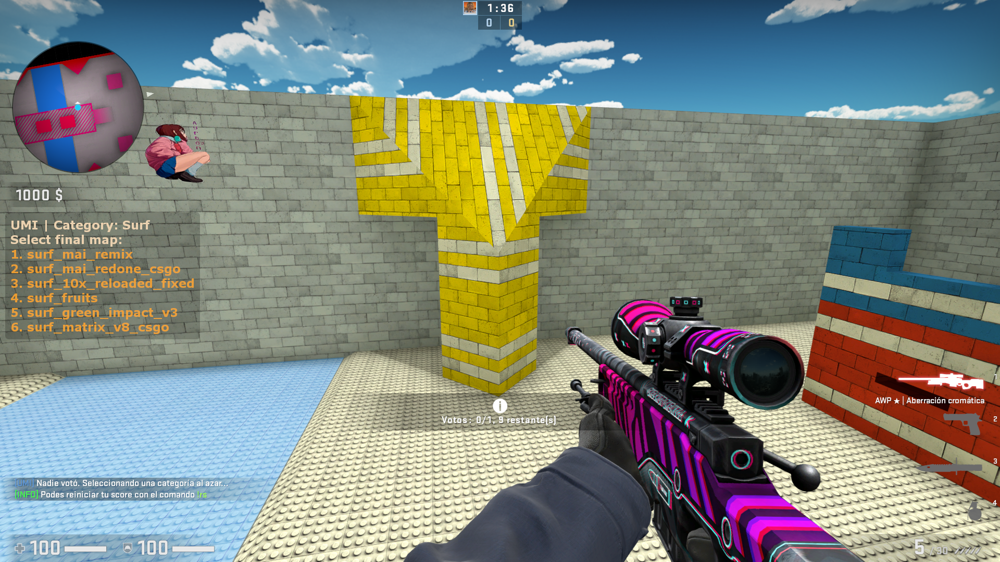
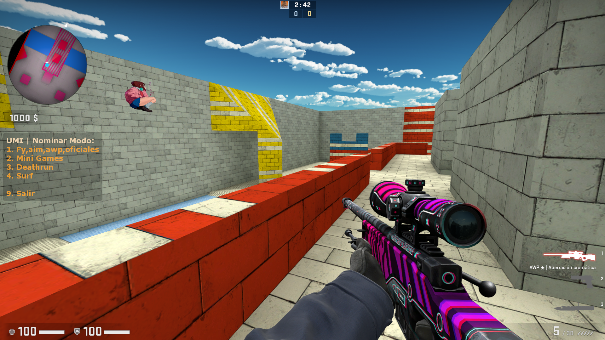

# Umbrella Multimod Interface (UMI)



UMI is a SourceMod plugin that provides a 2-phase multimod voting system with nominations, RTV, tie-break support, admin controls, and native Workshop-aware map entries.

It is designed to work across SourceMod-supported Source engine games, while some game-specific behaviors may depend on the events, map flow, or Workshop commands available in each title.

## Screenshots

### Category Vote



### Final Map Vote



### Nomination Menu



## Features

- 2-phase vote flow:
  - Phase 1: category/mod selection
  - Phase 2: final map selection
- Player nominations with `!nominate`
- RTV support with configurable ratio and startup delay
- RTV fast-forward when a next map is already scheduled
- Tie-break votes for first-place ties in both voting phases
- Admin menu integration for force vote, set next map, cancel vote, extend map, abort scheduled change, and reload mapcycle
- Recent-map history filtering
- Configurable sounds for vote start, win, and tie-break
- Translation-driven chat and menu text via `phrases.txt`
- Native Workshop-aware mapcycle entries with custom display names

## Requirements

- SourceMod 1.10 or newer
- `sdktools`
- `multicolors`
- Optional: `adminmenu`

## Game Compatibility

UMI is intended to be compatible with any Source engine game supported by SourceMod.

Notes:

- Core vote flow, nominations, RTV, admin controls, translations, and mapcycle handling are game-agnostic
- Round-end behavior may vary depending on the events exposed by a specific game
- Workshop map changing depends on whether the game/server exposes a supported Workshop command

## Repository Layout

- `addons/sourcemod/plugins/umbrella_umi.smx`
- `addons/sourcemod/scripting/umbrella_umi.sp`
- `addons/sourcemod/translations/umi_multimod.phrases.txt`
- `addons/sourcemod/configs/umi_mapcycle.txt`

## Installation

1. Copy the `addons` folder into your game server
2. Change map or load the plugin

UMI auto-generates:

- `cfg/sourcemod/umbrella_multimod_interface.cfg`

## Commands

### Player Commands

- `!nominate`
- `!rtv`

### Admin Commands

- `sm_umi_force`
- `sm_umi_setnext`
- `sm_umi_cancel`
- `sm_umi_extend`
- `sm_umi_abort`
- `sm_umi_reload`

## Mapcycle Format

The mapcycle file uses KeyValues:

```txt
"umi_mapcycle"
{
    "Competitive"
    {
        "de_mirage" {}
        "de_inferno" {}
    }
}
```

### Workshop Entries

UMI supports Workshop-aware entries directly in `umi_mapcycle.txt`.

```txt
"Workshop"
{
    "3234567890"
    {
        "display"  "Mirage Night (Workshop)"
        "map"      "de_mirage_night"
    }
}
```

Notes:

- The entry key can be a numeric Workshop ID
- `display` is the visible name shown in votes/chat
- `map` is optional, but recommended for better history matching and fallback behavior
- If the game/server exposes a Workshop change command, UMI will use it automatically

## Version

Current release: `1.0.0`

## License

No license file is currently included in this repository.
