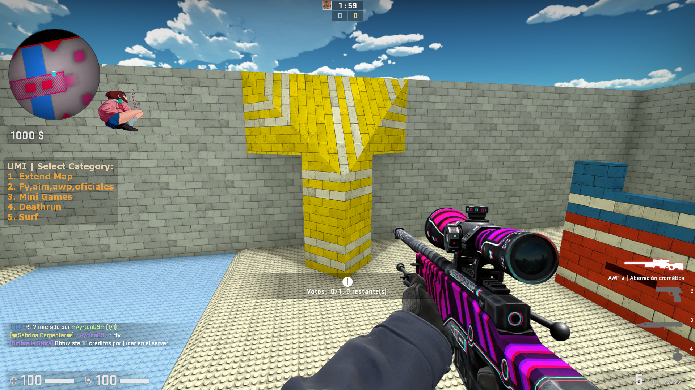
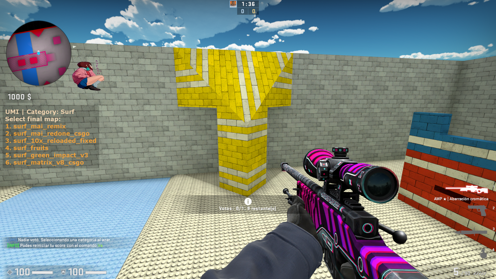
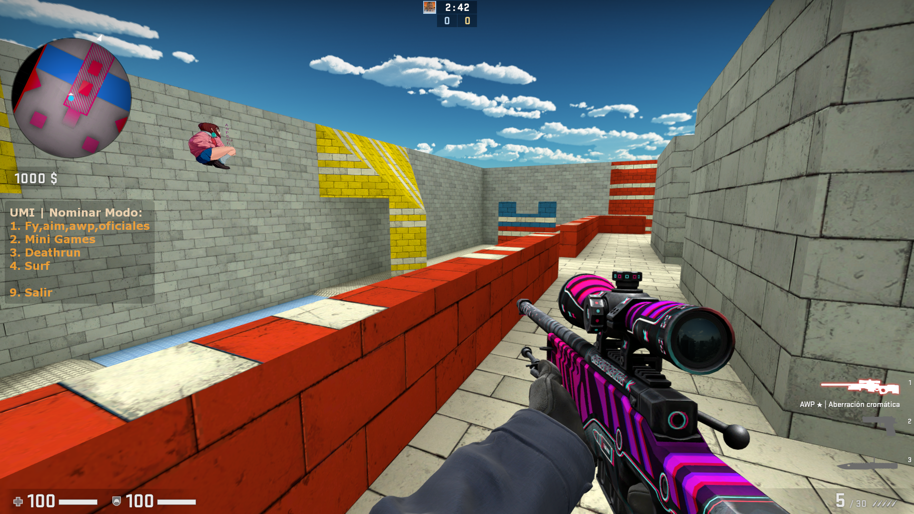

# Umbrella Multimod Interface (UMI)


A two-phase map voting system for SourceMod servers that run several mods or map
pools at once. Players first vote for a **category**, then for a **map inside
that category** — so a server hosting competitive, aim and retake pools never
mixes them in the same ballot.

Includes nominations, RTV, tie-break runoffs, an admin menu, recent-map history
and Workshop-aware mapcycle entries. All chat and menu text is translated.

---

## How it works

```
                 RTV threshold reached
                 or timelimit nearing
                          |
                          v
   Phase 1  ─────────────────────────────  vote the category
   [ Extend Map ]  [ Competitive ]  [ Aim ]  [ Retake ]  ...
                          |
                          |  winner (ties go to a runoff)
                          v
   Phase 2  ─────────────────────────────  vote the map
   Nominated maps first, then random picks from the winning
   category, skipping anything in the recent-map history.
                          |
                          v
          Map change: instantly, or at round end
```

## Screenshots

| Category vote | Final map vote | Nomination menu |
|:---:|:---:|:---:|
|  |  |  |

## Features

- **Two-phase vote** — category first, map second
- **Nominations** with `!nominate`, shown first in the phase 2 ballot
- **RTV** with configurable ratio and startup delay; once a next map is already
  decided, RTV turns into a "skip to it now" vote instead
- **Tie-break runoffs** for first-place ties in both phases, with a random
  fallback when the runoff limit is reached
- **Extend Map** as a phase 1 option, with a per-map extension limit
- **Recent-map history** excluded from nominations and phase 2 options
- **Admin menu**: force vote, set next map, cancel vote, extend, abort a
  scheduled change, reload the mapcycle
- **Workshop-aware entries** with custom display names
- **9 languages**: English, Spanish, Portuguese, Russian, Chinese, German,
  French, Polish, Turkish

## Requirements

SourceMod 1.12 or newer.

## Installation

1. Copy the `addons` and `sound` folders into your game server
2. Edit `addons/sourcemod/configs/umi_mapcycle.txt` with your own map groups
3. Change map, or `sm plugins load umbrella_umi`

On first run UMI generates `cfg/sourcemod/umbrella_multimod_interface.cfg` with
every ConVar below.

The two default vote sounds ship with the plugin under
`sound/admin_plugin/actions/` and are added to the downloads table automatically.

## Commands

| Command | Access | Description |
|---|---|---|
| `!nominate` | everyone | Pick a map for the next phase 2 vote |
| `!rtv` | everyone | Rock the vote, or skip to the decided next map |

Typing `rtv` or `nominate` in chat without a prefix works too.

## Admin menu

UMI adds a category to the SourceMod admin menu (`!admin`):

| Action | Flag |
|---|---|
| Force vote | `changemap` |
| Set next map (now / round end / map end) | `changemap` |
| Cancel current vote | `changemap` |
| Extend map | `changemap` |
| Abort scheduled map change | `changemap` |
| Reload mapcycle | `config` |

## ConVars

### Voting

| ConVar | Default | Range | Description |
|---|---|---|---|
| `umi_vote_start_time` | `3.0` | 0-60 | Minutes before map end to auto-start a vote. `0` disables it. Needs a `mp_timelimit` to be set |
| `umi_max_options` | `6` | 2-10 | Map options in the phase 2 ballot (nominations first, then random) |
| `umi_history_size` | `10` | 0-100 | Recent maps excluded from nominations and phase 2. `0` disables |
| `umi_action_auto` | `1` | 0-1 | After an auto vote: `0` change now, `1` change at round end |
| `umi_action_rtv` | `1` | 0-1 | After an RTV vote: `0` change now, `1` change at round end |
| `umi_strict_map_validation` | `0` | 0-1 | `1` rejects maps that fail `IsMapValid`; `0` allows them |

### RTV

| ConVar | Default | Range | Description |
|---|---|---|---|
| `umi_rtv_ratio` | `0.5` | 0.05-1.0 | Share of human players needed. `0.5` = 50% |
| `umi_rtv_delay` | `2.0` | 0-60 | Minutes after map start before `!rtv` is allowed |

### Extend

| ConVar | Default | Range | Description |
|---|---|---|---|
| `umi_extend_time` | `15` | 1-180 | Minutes added per extension |
| `umi_extend_limit` | `2` | 0-20 | Extensions allowed per map. `0` hides the Extend Map option |

### Tie-break

| ConVar | Default | Range | Description |
|---|---|---|---|
| `umi_tiebreak_enable` | `1` | 0-1 | `0` picks a random winner instead of a runoff |
| `umi_tiebreak_time` | `15` | 5-60 | Runoff duration in seconds |
| `umi_tiebreak_max_rounds` | `1` | 0-5 | Runoffs before falling back to random |
| `umi_tiebreak_announce` | `1` | 0-1 | Announce ties and random fallbacks in chat |

### Sounds

| ConVar | Default | Description |
|---|---|---|
| `umi_sound_start` | `admin_plugin/actions/startyourvoting.mp3` | Played when a vote starts |
| `umi_sound_win` | `admin_plugin/actions/endofvote.mp3` | Played when a map wins |
| `umi_tiebreak_sound` | *(empty)* | Played when a runoff starts. Empty reuses `umi_sound_start` |

### Debug

| ConVar | Default | Range | Description |
|---|---|---|---|
| `umi_debug` | `0` | 0-1 | Verbose logging to the server console and logs |

## Mapcycle

`addons/sourcemod/configs/umi_mapcycle.txt` is a KeyValues file. Every
first-level section is a category, every subkey inside it is a map:

```
"umi_mapcycle"
{
    "Competitive"
    {
        "de_mirage"  {}
        "de_inferno" {}
        "de_nuke"    {}
    }

    "Aim"
    {
        "aim_map"     {}
        "aim_redline" {}
    }
}
```

### Workshop entries

A section keyed by a numeric Workshop ID becomes a Workshop entry:

```
"Workshop"
{
    "3234567890"
    {
        "display"  "Mirage Night (Workshop)"
        "map"      "de_mirage_night"
    }
}
```

- `display` is the name shown in votes and chat
- `map` is the real internal map name. Optional, but **recommended**: it is what
  makes recent-map history and the non-Workshop fallback work
- UMI picks the Workshop change command the server actually exposes
  (`host_workshop_map`, `workshop_changelevel`, `ds_workshop_changelevel`), and
  falls back to a plain map change when none is available

Avoid listing the same map in two categories unless you mean it — a map belongs
to one category for nomination purposes.

## Game compatibility

UMI targets any Source engine game SourceMod supports. The vote flow,
nominations, RTV, admin controls and mapcycle handling are game-agnostic.

Two things vary by game:

- **Round-end changes** depend on the events the game exposes. UMI hooks
  `teamplay_round_win` on TF2, `round_end` elsewhere, plus `cs_win_panel_match`
  on CS:GO
- **Workshop map changes** depend on the server exposing a Workshop command

## Building

`multicolors` ships with the repository, so no external includes are needed:

```sh
spcomp -i <sourcemod>/addons/sourcemod/scripting/include \
       -i addons/sourcemod/scripting/include \
       -o addons/sourcemod/plugins/umbrella_umi.smx \
       addons/sourcemod/scripting/umbrella_umi.sp
```

## Repository layout

```
addons/sourcemod/
├── configs/umi_mapcycle.txt
├── plugins/umbrella_umi.smx
├── scripting/
│   ├── umbrella_umi.sp
│   └── include/multicolors.inc + multicolors/
└── translations/umi_multimod.phrases.txt
sound/admin_plugin/actions/
├── startyourvoting.mp3
└── endofvote.mp3
```

## License

GPLv3 — see [LICENSE](LICENSE).
